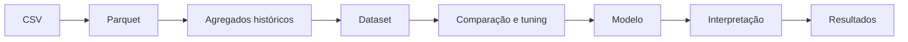
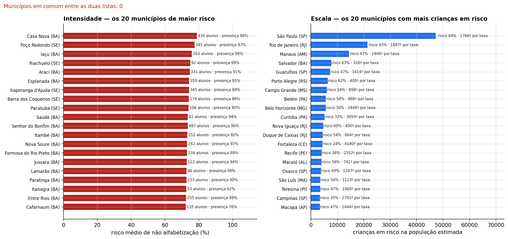
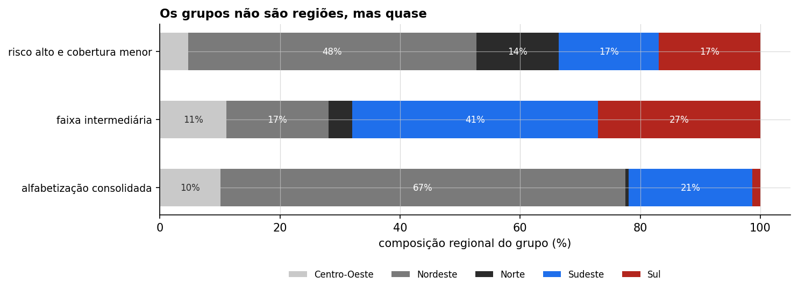

# Tech Challenge — Fase 3: Alfabetização no Brasil


Grupo: Eduardo Rossi | Luis Loschi | Luiza Santos | Vitória Santos | Vyctor Correia

Projeto desenvolvido para o **Tech Challenge da Fase 3 da FIAP (IA Scientist)**, com o objetivo de construir uma pipeline de dados
utilizando soluções analíticas e modelos de Machine Learning capazes de gerar inteligência aplicada à tomada de decisão. 

## 📌 Sumário

- [Contexto do problema](#contexto-do-problema)
- [Objetivo analítico](#objetivo-analítico)
- [Insights encontrados](#insights-encontrados)
- [Descrição da base utilizada](#descrição-da-base-utilizada)
- [Estrutura do repositório](#estrutura-do-repositório)
- [Como reproduzir](#como-reproduzir)
- [Etapas de modelagem](#etapas-de-modelagem)
- [Feature engineering](#feature-engineering)
- [Escolha do algoritmo](#escolha-do-algoritmo)
- [Métricas de avaliação](#métricas-de-avaliação)
- [Interpretação dos resultados](#interpretação-dos-resultados)
- [Aplicação prática para políticas públicas](#aplicação-prática-para-políticas-públicas)
- [Limitações do projeto](#limitações-do-projeto)
- [Possíveis evoluções futuras](#possíveis-evoluções-futuras)
- [Entrega Executiva](#entrega-executiva)
- [Conclusão](#conclusao)

<a id="contexto-do-problema"></a>
## 🔎 Contexto do problema

A alfabetização infantil é um dos principais indicadores de desenvolvimento educacional e social de uma nação. No Brasil, garantir que crianças estejam alfabetizadas na idade certa é um desafio complexo que envolve disparidades regionais, socioeconômicas e infraestruturais.

Compreender apenas os dados históricos passados não é suficiente para a tomada de decisão estratégica no setor público. Gestores educacionais necessitam antecipar riscos, identificar municípios vulneráveis e compreender quais fatores possuem maior impacto direto nos indicadores educacionais. A Ciência de Dados e a Inteligência Artificial desempenham um papel fundamental nesse cenário, transformando dados públicos brutos em inteligência analítica aplicável para formulação e ajuste de políticas públicas.

O projeto usa dados de 2023 e 2024 da Fase 2 do curso para
predição dos cenários.

<a id="objetivo-analítico"></a>
## 🎯 Objetivo analítico

Desenvolver uma **pipeline completa de Machine Learning supervisionado** capaz de prever se um aluno (ou indicador municipal/escolar) será considerado **Alfabetizado** ou **Não Alfabetizado**, utilizando variáveis educacionais, territoriais, populacionais e socioeconômicas e bases públicas complementares.

### Perguntas de Negócio Orientadoras
- **Fatores Determinantes:** Quais variáveis socioeconômicas e infraestruturais têm maior peso na probabilidade de alfabetização?
- **Mapeamento de Risco:** Quais municípios ou regiões apresentam maior risco de descumprimento das metas educacionais?
- **Agrupamento Territorial:** Quais regiões possuem padrões educacionais e socioeconômicos semelhantes?
- **Suporte à Decisão:** Como utilizar as predições do modelo para alocação eficiente de recursos do FUNDEB e ações preventivas do Ministério da Educação e Secretarias Estaduais/Municipais?

<a id="insights-encontrados"></a>
## 💡 Insights encontrados

- *O modelo é essencialmente territorial.* Histórico municipal (57,2%) e contexto territorial de UF/região (27,6%) explicam juntos 84,8% do comportamento do modelo — o SHAP aponta o peso do ambiente onde o aluno estuda, não uma característica individual da criança.
- *Uma única variável concentra um terço da importância.* A média municipal de Língua Portuguesa em 2023 responde por 33% do SHAP, reforçando que o histórico recente do território pesa mais do que qualquer atributo estrutural isolado.
- *O algoritmo não é o gargalo.* O ganho do LightGBM sobre uma heurística simples de uma variável é de apenas ~0,027 de ROC-AUC — evidência de que o teto de desempenho está nas fontes de dados disponíveis, não na complexidade do modelo.
- *O território brasileiro não é homogêneo.* Emergem 3 perfis nítidos (consolidado 92,6%, intermediário 73,4%, risco alto 43,9%), com concentração regional que foge da intuição comum: Nordeste domina o perfil consolidado (67% dos municípios), Nordeste+Norte concentram o perfil de risco alto e menor cobertura (62%), e Sudeste+Sul concentram o perfil intermediário (68%).
- *Priorizar por taxa ou por volume muda o resultado.* Ordenar municípios por taxa de vulnerabilidade e por volume absoluto de alunos em risco produz rankings diferentes — a escolha da métrica de priorização altera quem aparece no topo.
- *A maioria já está perto da meta de 2025, mas o restante não é trivial.* 43,4% dos municípios já superam a meta de 2025 com a taxa de 2024, porém o gap mediano remanescente (2,24 p.p.) exige esforço real em rede — e o próprio modelo de projeção, avaliado fora do ajuste, não supera um baseline simples (ROC-AUC 0,5455, intervalo de ganho de Brier que inclui zero), sinalizando alta incerteza sobre a trajetória futura.
- *Importância deve ser lida por família, não por coluna.* Dez das vinte features, quando removidas isoladamente, não superam o piso de ruído — a leitura correta considera blocos correlacionados de atributos, não colunas isoladas.

> Para o detalhamento pergunta a pergunta (fatores, risco municipal, agrupamento regional, metas futuras e variáveis mais influentes), veja a seção [Conclusão](#conclusao).

<a id="descrição-da-base-utilizada"></a>
## 📝 Descrição da base utilizada

Sete fontes: 
- Gold em grão aluno; 
- microdado INEP; 
- agregados de município e UF;
- metas municipais;
- estaduais e nacionais; 

Veja [origens e contagens](data/README.md) e [manifesto SHA-256](data/manifesto_fontes.json).

OBS: Nessa análise temos dados educacionais de 2023 e 2024.

<a id="estrutura-do-repositório"></a>
## 📁 Estrutura do repositório

```text
├── data/                         # Fontes, referências e datasets
│   ├── raw/                      # Entrada imutável, 830 MB, fora do Git
│   ├── reference/                # dim_municipio.csv — o único dado versionado
│   ├── interim/                  # Dados Parquet por ano
│   └── processed/                # dataset_2024.parquet e os agregados municipais
│
├── notebooks/                    # Análises exploratórias e experimentos
│
├── scripts/                      # Refinamento e execução do projeto
│   ├── etl/                      # Tratamento inicial dos dados
│   ├── verificar_insumos.py      # Passo 1 — SHA-256 das sete fontes
│   ├── prepare_data.py           # Passo 2
│   ├── build_dim_municipio.py    # Passo 3
│   ├── experimento_b5.py         # Passo 5  - ablação de atributos, só no desenvolvimento
│   ├── reproduzir.py             # O orquestrador dos três blocos
│   └── executar_notebooks.py     # Reexecuta notebooks sem kernel registrado
│
├── src/
│   ├── config.py                  # Caminhos, RANDOM_STATE e COLS_PROIBIDAS
│   ├── eda.py                     # Medições e gráficos da etapa exploratória
│   ├── data/                      # Loader de dados
│   │   └── loader.py              # Leitura das bases
│   ├── preprocessing/             # Limpeza, imputação e encoders
│   │   ├── feature_store.py       # Constrói os agregados históricos de 2023
│   │   ├── build_dataset.py       # Passo 3
│   │   ├── pipeline.py            # ColumnTransformer e o contrato de colunas
│   │   └── diagnostico.py         # julga a feature que o feature_store construiu
│   ├── modeling/                  # Treinamento dos modelos
│   │   ├── split.py               # GroupShuffleSplit e StratifiedGroupKFold por município
│   │   ├── baselines.py           # A heurística de uma variável, como estimador sklearn
│   │   ├── train.py               # Passos 5, 6 e 7
│   │   ├── tuning.py              # Busca de hiperparâmetros
│   │   ├── campeao.py             # Refit final e salvamento do modelo
│   │   ├── calibracao.py          # a isotônica testada e rejeitada
│   │   ├── metas.py               # Cálculo e acompanhamento das metas
│   │   └── strategic.py           # Passo 10
│   ├── evaluation/                # Métricas e validação
│   │   ├── metrics.py             # Métricas, bootstrap e limiares
│   │   ├── comparacao.py          # Teste de diferença relevante
│   │   ├── protocolo.py           # Limites da evidência e validação
│   │   ├── rigor.py               # Passo 8
│   │   └── interpret.py           # Passo 9
│   └── visualization/             # Gráficos e relatórios visuais
│      
├── tests/                         # Testes
│
├── reports/                       # Documentação, métricas e resultados
│   ├── metrics/                   # Datasets modelados
│   └── images/                    # Imagens dos relatórios
│
├── .gitignore                     # Arquivos ignorados pelo Git
├── GUIA_DE_EXECUCAO.md            # Documentação execução do projeto
├── README.md                      # Documentação principal
└── requirements.txt               # Dependências do projeto  
```

<a id="como-reproduzir"></a>
## ⚙ Como reproduzir

> Para reproduzir com mais detalhes, o arquivo [GUIA DE EXECUÇÃO](GUIA_DE_EXECUCAO.md) foi criado com passo a passo mais explicativo.

Use Python 3.14 e um ambiente virtual. No PowerShell:

```powershell
python -m venv .venv
.\.venv\Scripts\python.exe -m pip install -r requirements.txt
.\.venv\Scripts\python.exe scripts/verificar_insumos.py
.\.venv\Scripts\python.exe scripts/reproduzir.py --etapa dados
.\.venv\Scripts\python.exe scripts/reproduzir.py --etapa relatorios
.\.venv\Scripts\python.exe -m pytest -q
```

> OBS: `--etapa relatorios` requer o classificador e as métricas de interpretação já gerados. Para refazer tudo, use `--etapa tudo`: inclui treinos e os experimentos. `TC_DATA_DIR` permite mudar a pasta de dados. Um clone requer os sete CSVs fornecidos pelo grupo. O manifesto confere a versão, mas não substitui o fornecimento. 

<a id="etapas-de-modelagem"></a>
## 📑 Etapas de modelagem



A Gold foi reconciliada com o microdado: identificamos IDs reciclados entre anos, removemos registros sem medida válida e excluímos proficiência contemporânea, identificadores e participação da própria prova dos preditores. Os pesos são usados nas agregações populacionais.

O pipeline usa um `ColumnTransformer` para imputação, escala e encoding antes do modelo.
O ajuste é feito apenas no treino de cada fold, e a reserva contém municípios diferentes
dos usados no desenvolvimento.

Importante: a seleção de atributos consultou toda a base de 2024. Isso significa que as métricas públicas não são uma avaliação confirmatória totalmente independente. O experimento em `scripts/experimento_b5.py` separa a reserva antes de qualquer seleção,
preservando a partição para decisões futuras sem tornar o resultado já publicado independente.

<a id="feature-engineering"></a>
## 🧩 Feature engineering

O dataset final reúne **1.851.852 alunos e 20 atributos** usados pelo modelo, principalmente informações históricas de município, UF e território. As features são montadas com dados de 2023
e combinam a Gold com agregados do INEP quando necessário. Essa coalescência cobre 98,09% da coorte e registra a origem de cada valor para evitar misturar fontes com diferentes níveis de
fidelidade.

O histórico escolar foi retirado porque `id_escola` é reciclado entre as edições: um mesmo ID pode apontar para outra escola em 2024. Os percentis de proficiência do microdado também ficaram fora do conjunto principal, pois o experimento B5 (comparação entre conjuntos de atributos para verificar se os percentis melhoram o modelo) encontrou ganho muito pequeno e compatível com zero.

Os agregados populacionais usam `peso_aluno` para se aproximar das taxas oficiais do INEP. O peso é aplicado às estatísticas populacionais, não diretamente ao treinamento no nível do aluno. O
processo também exclui variáveis contemporâneas que poderiam causar vazamento e verifica se nenhuma coluna proibida entrou no modelo.

<a id="escolha-do-algoritmo"></a>
## 🛠 Escolha do algoritmo

A seleção do algoritmo foi conduzida por meio de comparação sistemática entre uma linha de base estatística (`Dummy`), duas heurísticas, um modelo logístico, `Random Forest` e `LightGBM` em versões padrão e ajustadas por hiperparâmetros. A comparação considerou não apenas a capacidade preditiva, mas também a estabilidade do desempenho em validação por município, a interpretabilidade do artefato e o custo operacional de treinamento e manutenção.

O modelo final adotado foi o `LightGBM`, preservado em artefato para permitir a análise dos resultados e a interpretação dos fatores mais relevantes. Em comparação com o `Random Forest`, o desempenho foi equivalente em termos práticos, sem evidência robusta de ganho mensurável que justificasse a complexidade adicional do ajuste fino. Dessa forma, não se sustenta uma vantagem comprovada do tuning neste contexto, e a decisão foi guiada pela melhor relação entre desempenho, robustez e praticidade analítica.

 Modelo | Papel | ROC-AUC | dp entre folds | PR-AUC | Brier | s/fold |
|---|---|---:|---:|---:|---:|---:|
| **lightgbm_tunado** | **campeão** | **0,6611** | 0,0104 | 0,5519 | 0,2223 | 17 |
| random_forest | não-linearidade sem boosting | 0,6610 | 0,0102 | 0,5521 | 0,2224 | 89 |
| lightgbm_padrao | hiperparâmetros de partida | 0,6589 | 0,0098 | 0,5492 | 0,2229 | 11 |
| logistica_podada | linear, 8 colunas, VIF < 3 | 0,6513 | 0,0113 | 0,5389 | 0,2246 | 2 |
| heuristica_proficiencia_municipal | regra de uma variável, contínua | 0,6388 | 0,0144 | 0,5255 | 0,2269 | 0,7 |
| heuristica_taxa_municipal | **a barra** | 0,6337 | 0,0135 | 0,5227 | 0,2278 | 0,6 |
| dummy_prior | piso absoluto | 0,5000 | 0,0000 | 0,4067 | 0,2413 | — |

A calibração isotônica também não foi adotada, pois não trouxe melhora consistente no critério de Brier no conjunto de desenvolvimento.

<a id="métricas-de-avaliação"></a>
## 📊 Métricas de avaliação

A avaliação foi conduzida em uma reserva retrospectiva composta por 330.836 alunos distribuídos em 1.104 municípios. Os intervalos de confiança reportados abaixo foram estimados por bootstrap municipal, conforme o artefato histórico, e refletem a variabilidade entre municípios, mas não corrigem a participação prévia da reserva na etapa de seleção de atributos.

| Métrica | Valor | IC95 registrado |
|---|---:|---|
| ROC-AUC | 0,6599 | [0,6314; 0,6853] |
| Average Precision (`pr_auc` no código) | 0,5360 | [0,5056; 0,5672] |
| Brier | 0,21794 | [0,21174; 0,22321] |

Esses indicadores mostram que o modelo possui capacidade discriminatória moderada e calibração aceitável para um problema público com forte componente territorial e desbalanceamento entre classes. O ROC-AUC de 0,6599 indica separação útil, embora não perfeita, entre casos mais e menos vulneráveis. O Average Precision de 0,5360 reforça a utilidade do modelo para priorização quando o objetivo é identificar corretamente os casos positivos mais relevantes. Já o Brier de 0,21794 aponta uma probabilidade preditiva razoável, sem sugerir ajuste excessivamente otimista.

No limiar de capacidade definido durante o desenvolvimento, o modelo alcançou precisão de 62,01%, recall de 21,06%, F1 de 0,3144 e taxa de alerta de 12,95% no teste. A matriz de confusão correspondente foi: VN 188.438, FP 16.270, FN 99.568 e VP 26.560. Esses valores devem ser interpretados como estimativas pontuais para um corte específico e não como garantia de desempenho equivalente em outra distribuição ou em cenário prospectivo.

A importância dessa observação está em reconhecer que um corte definido para 20% do desenvolvimento não garante 20% em um conjunto novo, mesmo quando a estrutura do problema permanece semelhante.

<a id="interpretação-dos-resultados"></a>
## 📝 Interpretação dos resultados

As análises de interpretabilidade e auditoria mostram que o modelo é essencialmente territorial e deve ser interpretado no nível municipal. A camada Gold foi reconciliada com o microdado do INEP sem divergências no alvo, nos identificadores ou nas principais dimensões territoriais. Os agregados populacionais usam `peso_aluno` para aproximar as taxas oficiais, embora esse procedimento não elimine possíveis vieses de ausência.

### Principais achados

| Evidência | Resultado |
|---|---:|
| Histórico municipal no SHAP agrupado | 57,2% |
| Contexto territorial no SHAP agrupado | 27,6% |
| Histórico municipal + contexto territorial | 84,8% |
| Principal variável | Média municipal de Língua Portuguesa em 2023, com 33,0% do SHAP |

As variáveis que aparecem de forma mais consistente são a média municipal de Língua Portuguesa, a taxa municipal de alfabetização e a média de Português da UF. A permutação em famílias confirma que o histórico municipal é o bloco mais necessário ao modelo. Dez das vinte features, quando removidas isoladamente, não superam o piso de ruído, por isso, a importância deve ser lida por famílias, considerando a correlação entre atributos, e não apenas por coluna.

No nível municipal, o modelo explica melhor a variação observada: o R² chega a 0,78 entre municípios com pelo menos 200 alunos avaliados. Isso não significa que o modelo identifique individualmente quais alunos estão em risco. O histórico escolar não foi validado, pois os IDs de escola são reciclados entre as edições e não permitem acompanhamento longitudinal. 

### Ressalvas de interpretação

- A cobertura do histórico varia entre territórios. Municípios sem histórico, assim como aqueles com baixa presença na avaliação, apresentam menor qualidade de predição e devem ser analisados com essa informação explícita.
- SHAP, permutação e coeficientes indicam associação usada pelo modelo, não efeito causal de uma política pública.
- Os resultados são retrospectivos e exploratórios. Não sustentam diagnóstico individual, garantia prospectiva ou intervenção automatizada.


<a id="aplicação-prática-para-políticas-públicas"></a>
## ✔ Aplicação prática para políticas públicas

As políticas públicas devem ser direcionadas de forma territorial e preventiva. O modelo identificou que o histórico de alfabetização do município, a proficiência média em Língua Portuguesa e o contexto regional estão entre os fatores mais associados ao resultado. Portanto, é importante:

1. **Priorizar municípios de maior risco:** considerando tanto a taxa de vulnerabilidade quanto o número estimado de alunos afetados.

2. **Adotar estratégias diferentes por perfil territorial:** reforço intensivo nos municípios de risco alto, apoio pedagógico e formação continuada nas regiões intermediárias, e compartilhamento de boas práticas nos municípios com alfabetização consolidada.

3. **Fortalecer a aprendizagem:** com diagnóstico contínuo, recuperação das defasagens, acompanhamento individual dos estudantes e apoio aos professores.

4. **Monitorar as metas anualmente:** utilizando os resultados para ajustar recursos, formação docente e programas de intervenção, sem tratar as projeções como certezas.

5. **Distribuir recursos de maneira orientada por evidências:** combinando risco, quantidade de alunos, cobertura da avaliação e capacidade de execução local.

É importante destacar que o modelo deve ser utilizado como instrumento de apoio à decisão e priorização de territórios, e não como diagnóstico individual ou justificativa para intervenção automática. As ações precisam ser acompanhadas por avaliações periódicas, dados socioeconômicos mais completos e validação dos resultados ao longo do tempo.

<a id="limitações-do-projeto"></a>
## ❗ Limitações do projeto

### Validade do que foi medido
A seleção dos atributos usou todos os dados de 2024, então a reserva de teste não é totalmente independente. Em outras palavras, as métricas publicadas são retrospectivas e exploratórias, não uma confirmação prospectiva. Também não há validação temporal completa do classificador. Para testar 2023 precisaríamos de 2022, (que não está disponível) a checagem possível fora do tempo usa um modelo mais simples, limitado a UF, região e rede.

O risco de vazamento foi controlado pela remoção de variáveis contemporâneas ao desfecho, como a participação na avaliação do próprio ano. As metas e projeções também são cenários condicionais, não garantias de desempenho futuro. Retreinar o modelo com os mesmos dados não resolveria essa limitação, pois a reserva já foi consultada durante a seleção de atributos.

### Falta de dados na base 
Não há informações sobre o aluno, como nível socioeconômico, cor/raça, idade, frequência ou histórico escolar. Como o modelo é territorial, ele descreve o município, não a pessoa. Isso pode levar a conclusões erradas ao atribuir a um aluno as características do lugar onde ele vive. As chaves de escola são recicladas entre edições, o que impede o acompanhamento longitudinal, por isso, não dá para verificar com segurança o valor do histórico escolar.

As fontes disponíveis também não contêm uma dimensão socioeconômica integrada. Região, UF e rede de ensino não devem ser interpretadas como substitutos de renda ou nível socioeconômico. Além disso, Roraima não está na base, os dados brutos não são versionados no repositório e o calendário de publicação das fontes não foi auditado.

### Poucos dados de medição
Só entram alunos presentes com medida válida. A ausência não significa necessariamente falta de alfabetização, e territórios com baixa presença tendem a aparecer como menos vulneráveis do que realmente são. A ponderação por `peso_aluno` aproxima os resultados das taxas oficiais do INEP, mas depende da hipótese de que os ausentes sejam semelhantes aos presentes dentro do mesmo estrato; portanto, não elimina o viés de não resposta. Como o modelo tende a regressar para a média, ele pode subestimar o risco justamente onde o problema é maior.

### Limitações dos produtos de análise municipal
Não há intervalo de confiança para o risco de cada município, nem validação temporal do ranking. Como há apenas duas edições da prova, não existe um 2025 para comparar com a ordenação de 2024. A incerteza das posições também não foi quantificada. Os agrupamentos municipais são descritivos, apresentam sobreposição e não devem ser tratados como categorias permanentes.

O ranking deve ser usado para priorizar investigação e apoio, sempre acompanhado da taxa de presença, do número de alunos avaliados, da cobertura do histórico e da capacidade de execução local. Ele não deve ser usado para excluir municípios de políticas públicas, automatizar decisões ou atribuir responsabilidade a escolas e alunos.

<a id="possíveis-evoluções-futuras"></a>
## 🚀 Possíveis evoluções futuras

Três pontos estão abertos e dependem de coisas que não se resolvem escrevendo texto: 
- **Uma amostra ainda não consultada**, sem a qual não há confirmação prospectiva; 
- A **documentação da disponibilidade temporal** de cada fonte, que é o que autorizaria uso prospectivo; 
- A **integração de uma dimensão socioeconômica**, hoje ausente por falta de fonte integrada. Depois deles vêm medir a estabilidade do ranking e pactuar capacidade e custo com gestores. Novos algoritmos e tuning adicional não são a prioridade antes desses pontos — o ganho do modelo sobre uma regra de uma variável é de 0,027 de ROC-AUC, e o teto não está no algoritmo.

<a id="entrega-executiva"></a>
## 🎥 Entrega Executiva

Este projeto também inclui materiais voltados para stakeholders e lideranças, focados em tomada de decisão:

* **[Slides de Apresentação](apresentacao/PPT_Tech_Challenge_Fase_3.pptx):** Material visual com o contexto do problema, os principais insights, o valor estratégico da solução e como os modelos poderiam apoiar políticas públicas educacionais.

<a id="conclusao"></a>
## 💡 Conclusão

A partir das análises feitas nesse projeto, chegamos as seguintes conclusões sobre as 5 principais perguntas desse tech challenge:

### 1. Quais fatores estão associados à alfabetização?

O classificador usa contexto educacional e territorial. As participações abaixo descrevem
a contribuição SHAP do modelo salvo, não efeitos de intervenções.

| Família | Participação no SHAP absoluto agrupado |
|---|---:|
| historico_municipal | 57,2% |
| territorial | 27,6% |
| estrutural | 9,1% |
| metas | 4,8% |
| historico_escolar | 1,3% |

A interpretação é exploratória: a seleção histórica de atributos usou a base inteira.

Não há dados socioeconômicos ou medidas individuais de renda, frequência e trajetória.

O histórico escolar verdadeiro não foi avaliado: o identificador de escola é reciclado entre edições.

### 2. Quais municípios apresentam maior risco?

O ranking contém 5.517 municípios, com scores out-of-fold por município. A imagem abaixo mostra as duas formas de ordenar a mesma realidade: por risco contextual (taxa de vulnerabilidade) e por volume estimado de alunos em risco. Essas visões respondem a perguntas diferentes: uma ajuda a identificar onde o problema é mais intenso, a outra mostra onde o impacto absoluto é maior em termos de população.



AC e DF permanecem sem posição publicada, por cobertura e desempenho limitados. Roraima não está na base. `taxa_presenca_2024` e `n_alunos_avaliados` acompanham cada linha. `faixa_shap_taxa_municipal` marca apenas taxa anterior abaixo de 65% ou ausente. Uma contribuição SHAP plana de um atributo não comprova perda de ordenação do modelo completo. 

### 3. Quais regiões apresentam padrões semelhantes?

A análise regional foi feita com um agrupamento descritivo em 5.461 municípios, usando k=3 como solução mais estável entre valores testados de 3 a 8. O objetivo foi identificar perfis territoriais com comportamento educacional semelhante, sem transformar esses grupos em categorias naturais ou permanentes. A imagem abaixo mostra a composição regional desses perfis e como eles se distribuem em relação à alfabetização e à cobertura de informação.



Há 56 municípios excluídos por campos faltantes. Os grupos se sobrepõem e devem ser lidos como perfis exploratórios de 2024, não como classes definitivas da realidade territorial. As taxas abaixo são médias simples entre municípios do perfil, e não taxas populacionais ponderadas por número de alunos ou população total da região.

| Perfil | Municípios | Média municipal da taxa de 2024 |
|---|---:|---:|
| alfabetização consolidada | 378 | 92,6% |
| faixa intermediária | 2941 | 73,4% |
| risco alto e cobertura menor | 2142 | 43,9% |

- Nordeste é a região mais representada no perfil consolidado (67% dos municípios do grupo), seguida por Sudeste (21%); Sul é quase ausente nesse perfil.
- Nordeste e Norte concentram a maior parte do perfil de risco alto e cobertura menor (48% e 14%, respectivamente), somando 62% do grupo.
- Sudeste e Sul dominam o perfil intermediário (41% e 27%, respectivamente), somando 68% do grupo; Centro-Oeste tem participação menor (11%).

Essa estrutura sugere que o território brasileiro não é homogêneo: há um conjunto de municípios com alfabetização já consolidada, um grupo grande em faixa intermediária e outro com risco mais elevado e menor cobertura de dados. A visualização ajuda a reconhecer padrões regionais e a orientar políticas que diferenciem estratégias por perfil, em vez de tratar todos os municípios como se compartilhassem o mesmo contexto educativo.

### 4. Como analisar metas futuras?

**Gap de esforço:** meta de 2025 menos taxa de 2024, na mesma apuração municipal do INEP.
São 5352 municípios com meta e dados disponíveis;
165 ficam fora. Gap mediano de 2,24 pp;
43,4% já superam essa meta com a taxa de 2024.
É uma diferença observada, sujeita à qualidade e comparabilidade das duas medidas.

**Projeção:** persistência suavizada e deriva estimadas na transição 2023→2024.
O prior, a suavização, a deriva e a dispersão são aprendidos só nos municípios de treino de cada fold.
O porte usado para prever 2024 é de 2023. A prevalência do baseline também vem só do treino.
A aplicação a 2025 usa taxa e porte de 2024, com parâmetros refitados no histórico disponível.

A distribuição de trabalho é T=clip(Z,0,100), com Z normal. `projecao_2025` é sua mediana;
os limites são quantis de 2,5% e 97,5% dessa distribuição. A probabilidade de ficar abaixo
da meta é calculada com a mesma distribuição, respeitando as massas em 0 e 100.
`dp_latente_pp` é a dispersão de Z, não o desvio da taxa censurada.
A estimação da dispersão gaussiana é uma aproximação, a cobertura é avaliada empiricamente.

### Avaliação fora do ajuste

Cinco folds por município na mesma transição anual, com 4611 municípios.
**Não é um teste em ano futuro.** A disponibilidade histórica das publicações ainda precisa ser confirmada.

| Métrica | Valor | Intervalo bootstrap de 95% |
|---|---:|---|
| ROC-AUC | 0,5455 | [0,5283; 0,5631] |
| Brier | 0,24751 | [0,24474; 0,25019] |
| Ganho de Brier sobre prevalência do treino | 0,00142 | [-0,00157; 0,00433] |
| Cobertura do intervalo nominal de 95% | 94,60% | [93,95%; 95,21%] |

Os intervalos usam 1.000 reamostragens de municípios das predições OOF fixadas.
Não incluem incerteza de refit nem mudanças temporais, os folds compartilham parte do treino. O ganho de Brier inclui zero. A evidência não sustenta superioridade operacional sobre o baseline. Os métodos testados discriminam pouco, isso não prova que metas sejam intrinsecamente imprevisíveis.

### Cenários de 2025 e horizonte de 2030

Nos cenários de 2025, a largura mediana é 52,0 pp. A meta fica dentro do intervalo em 97,53% dos municípios. Os 132 casos fora do intervalo são resultados condicionais ao modelo, sem garantia de ocorrência. Não se publica rótulo de sucesso ou fracasso.

O porte de referência calculado é 129 alunos, onde a²/n=c². É uma descrição da curva ajustada, não identifica causas da variação nem determina quando um município pode ser avaliado individualmente. A coluna `porte_abaixo_referencia_dispersao` é descritiva e não deve restringir acesso a políticas.

Mantendo a taxa de 2024 constante, 21,3% já satisfariam a meta de 2030.
O gap mediano até 2030 é 15,75 pp em seis anos, equivalente a 2,625 pp/ano numa divisão linear. Esse exercício não é previsão da taxa de 2030. Mediana de gaps e deriva ponderada têm agregações distintas. Não se interpreta sua razão como multiplicador de esforço nacional.

### 5. Quais variáveis mais influenciam o modelo?

As variáveis mais influentes são as de histórico do município e o contexto territorial e a média de portugues municipal. A principal é a média de português do município em 2023, que responde por cerca de 33% do movimento total das previsões em SHAP e aparece consistentemente como a variável de maior impacto. Em seguida, entram o contexto de UF e as taxas municipais anteriores, especialmente a proficiência e a presença do município no ano anterior.